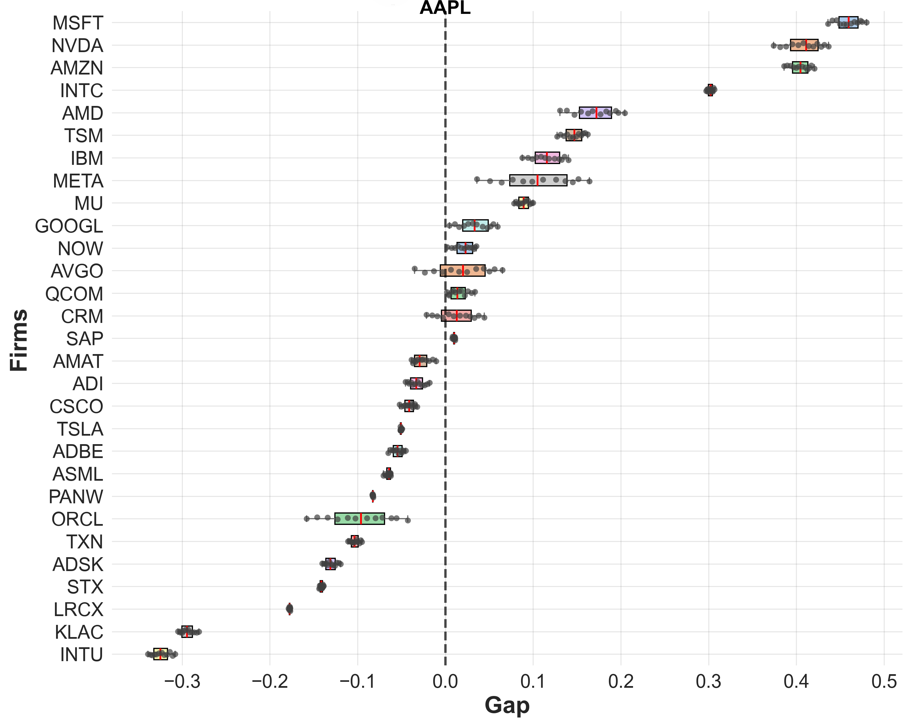
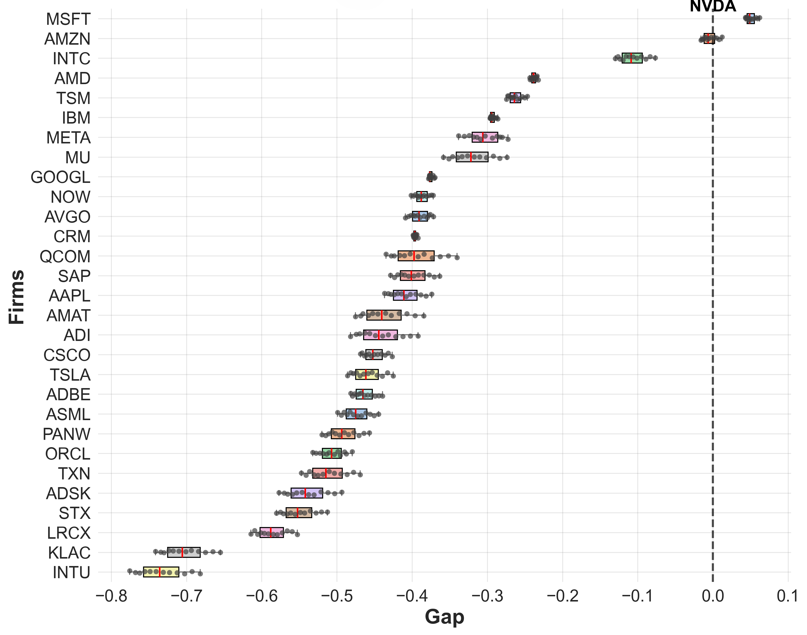

# AFCI — AI-Firm News Intelligence: Knowledge Graph, TemporalRAG & Forecasting

This repository accompanies a research project on constructing a news-based intelligence signal for 30 AI/IT companies. It combines (1) large-scale GDELT news collection, (2) a Neo4j knowledge graph with a Temporally-Bounded RAG (TBR) agent, and (3) a graph neural-network forecasting baseline (B-MTGNN).

---

## Results — AFCI forecasting

**AFCI forecast validation**:

| Apple (AAPL) | NVIDIA (NVDA) |
|:---:|:---:|
|  |  |

**Distribution of normalized AFCI competitive gaps** between the target firm and the other AI-firms:

| Apple (AAPL) | NVIDIA (NVDA) |
|:---:|:---:|
|  |  |

<sub>Figures reproduced from the submitted manuscript: AAPL / NVDA AFCI forecast validation and competitive-gap distributions.</sub>

---

## Repository structure

| Path | Description |
|---|---|
| `Agent/` | GDELT → Neo4j knowledge graph → TemporalRAG agent pipeline. See **[`Agent/README.md`](Agent/README.md)**. |
| `Agent/TemporalRAG/` | FastAPI backend + web UI (service layer) for the TemporalRAG agent. |
| `Agent/Multi_agent_Debate/` | Multi-agent debate module for analytical report generation. |
| `data_preparation/` | Fundamental-data pipeline: SEC filings fetch, topic modeling, dataset build, static graph, and export to B-MTGNN. See **[`data_preparation/README.md`](data_preparation/README.md)**. |
| `B-MTGNN/` | Graph neural-network forecasting model (MTGNN variant). See **[`B-MTGNN/README.md`](B-MTGNN/README.md)**. |
| `readme_Figure/` | Figures used in this README (reproduced from the paper). |

---

## Prerequisites

- **Python** 3.11+ (Recommend 3.13)
- **Neo4j** 2026.05.x (Community) with vector-index support
- **GPU + vLLM** for the embedding and LLM servers

Install per-component dependencies:

```bash
pip install -r Agent/requirements.txt             # Agent pipeline
pip install -r Agent/TemporalRAG/requirements.txt # Web service (optional)
```

---

## Configuration

```bash
cp .env.example .env
```

---

## Bringing up the services

```bash
# 1) Neo4j
# Start neo4j server.

# 2) Embedding server (vLLM, port 8000)
vllm serve jinaai/jina-embeddings-v3 --trust-remote-code \
  --port 8000 --host 0.0.0.0 --gpu-memory-utilization 0.15

# 3) LLM server (vLLM, port 8001)
vllm serve casperhansen/deepseek-r1-distill-qwen-7b-awq --port 8001 --host 0.0.0.0 \
  --quantization awq --dtype float16 --gpu-memory-utilization 0.7 \
  --trust-remote-code --reasoning-parser deepseek_r1 --max-model-len 32768

# 4) (optional) TemporalRAG Web UI
#    Agent/TemporalRAG/start.bat
```

---

## Quick start (Agent pipeline)

The full data → graph → RAG → agent flow, including run order and reproduction commands,
is documented in **[`Agent/README.md`](Agent/README.md)**.

---
